[](https://thebsd.github.io/StandWithPalestine)

<div align="center">
  

**moochat Decentralized Bluetooth Communication**

_Connect without internet, communicate without limits_

[](https://opensource.org/licenses/MIT)

[](https://github.com/Bloul-Mohamed/moochat_app/issues)
[](https://github.com/Bloul-Mohamed/moochat_app/issues)

[](https://github.com/Bloul-Mohamed/moochat_app/graphs/contributors)
[](https://github.com/Bloul-Mohamed/moochat_app/network/members)
[](https://github.com/Bloul-Mohamed/moochat_app/stargazers)

</div>

<div align="center">
  
  [](https://github.com/Bloul-Mohamed/moochat_app/releases)
  [](https://appdistribution.firebase.dev/i/7c5bc8c5617e8400)
  
  <p><em>Get the latest version of moochat for your Android device</em></p>
  
</div>

---

## 🚀 What is moochat?

moochat is a revolutionary **Bluetooth-only communication app** that enables peer-to-peer messaging without requiring internet connectivity. Perfect for areas with limited connectivity, emergency situations, or when you simply want to communicate privately without relying on centralized servers.

> [!WARNING]
> Private messages have not received external security review and may contain vulnerabilities. Do not use for sensitive use cases, and do not rely on its security until it has been reviewed. Now not uses any security protocol.

> [!NOTE]
> moochat is designed to be a **decentralized** communication tool, meaning it does not rely on any central servers or cloud services. All messages are sent directly between devices using Bluetooth, ensuring your privacy and security.

> [!IMPORTANT]
> moochat is currently in **beta**. We are actively working on improving features, fixing bugs, and enhancing the user experience. Your feedback is invaluable!

### ✨ Key Features

- 🔐 **Privacy First** - No servers, no data collection, your messages stay between you and your contacts
- 📡 **Offline Communication** - Works entirely through Bluetooth, no internet required
- 🌍 **Mesh Networking** - Messages can hop through multiple devices to reach their destination
- 💬 **Real-time Messaging** - Instant communication within Bluetooth range
- 🔋 **Battery Optimized** - Efficient Bluetooth usage to preserve device battery
- 🎨 **Modern UI** - Clean, intuitive interface built with Flutter

## 📱 Screenshots

<div align="center">
  
  ### Main Interface & Chat Features
  <table>
    <tr>
      <td>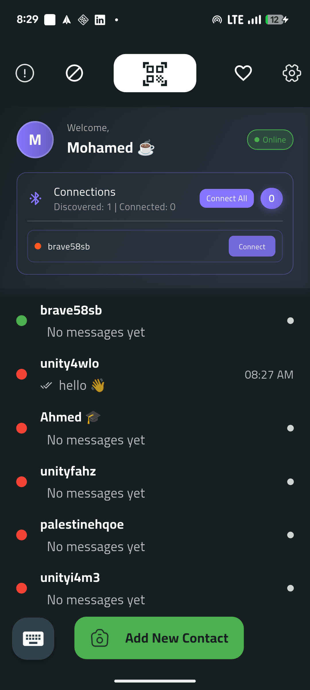</td>
      <td>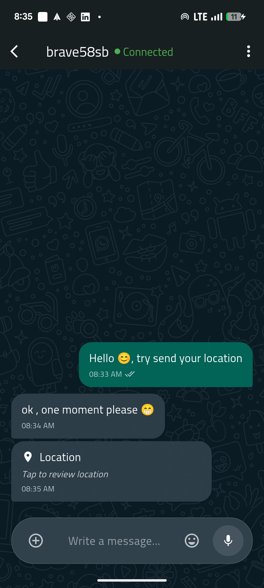</td>
      <td>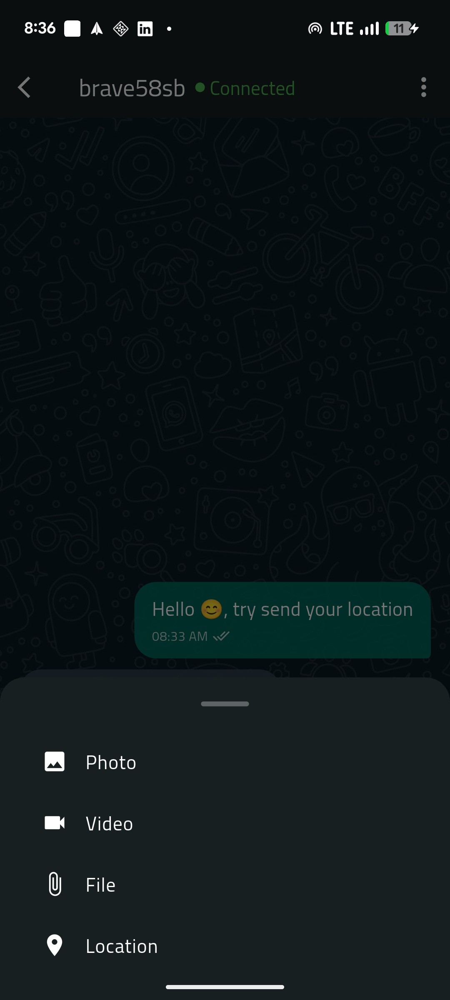</td>
      <td>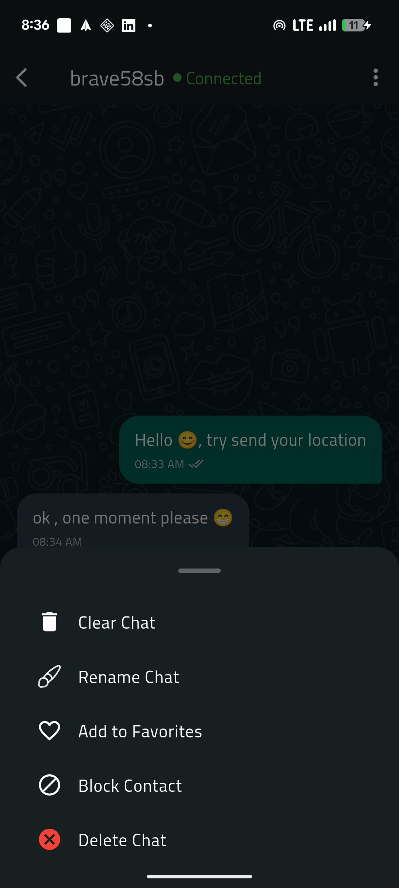</td>
      <td></td>
      <td>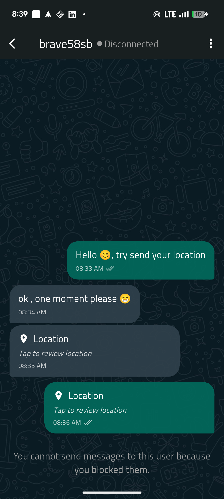</td>
    </tr>
  </table>

### Device Discovery & Connection

  <table>
    <tr>
      <td>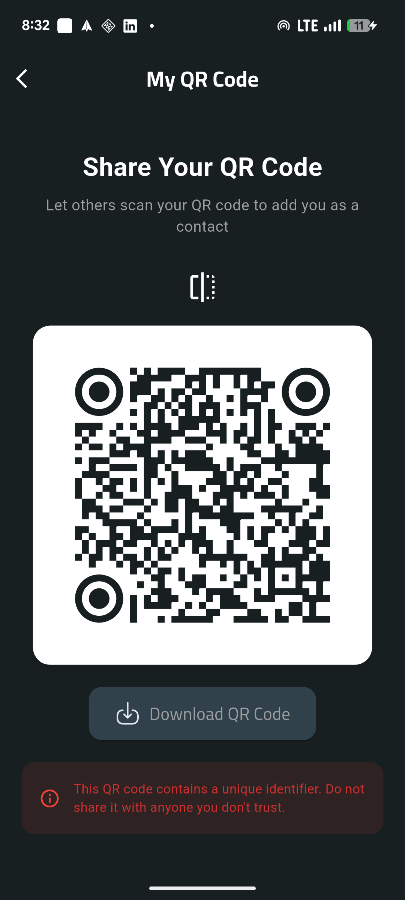</td>
      <td>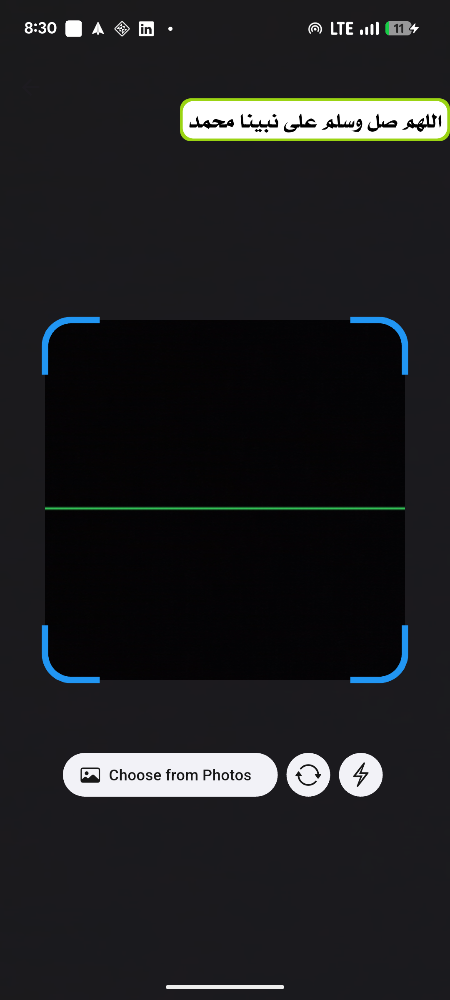</td>
      <td>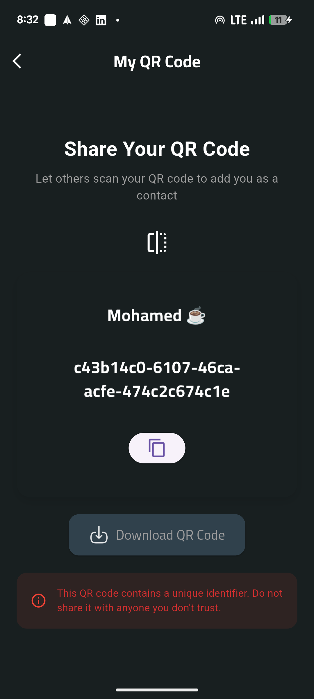</td>
      <td>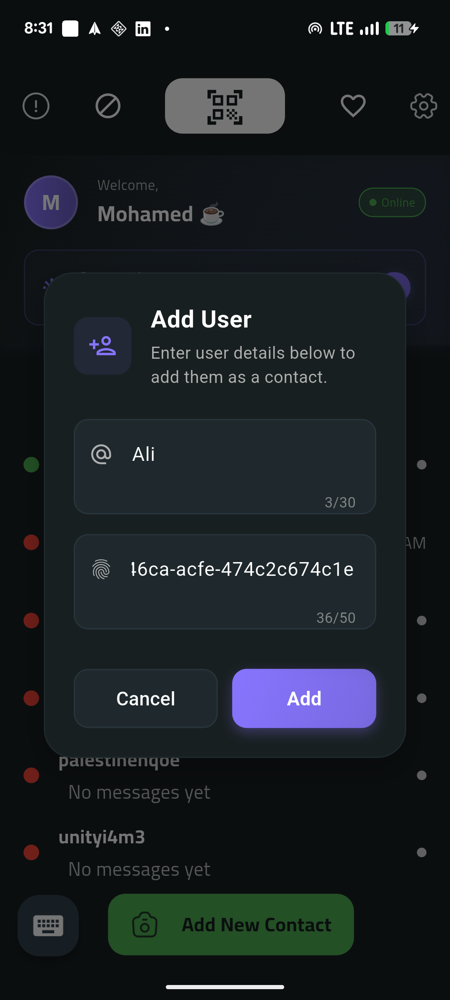</td>
      <td>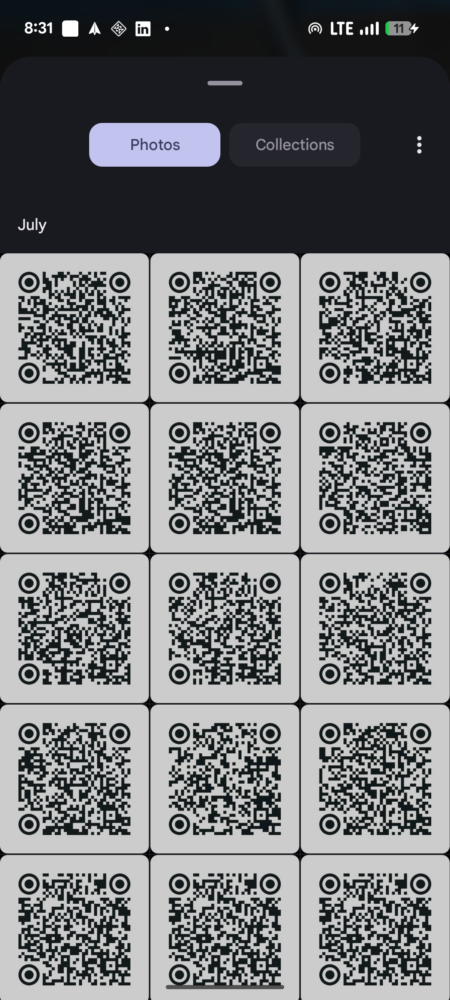</td>
    </tr>
  </table>

### Settings & Configuration

  <table>
    <tr>
      <td>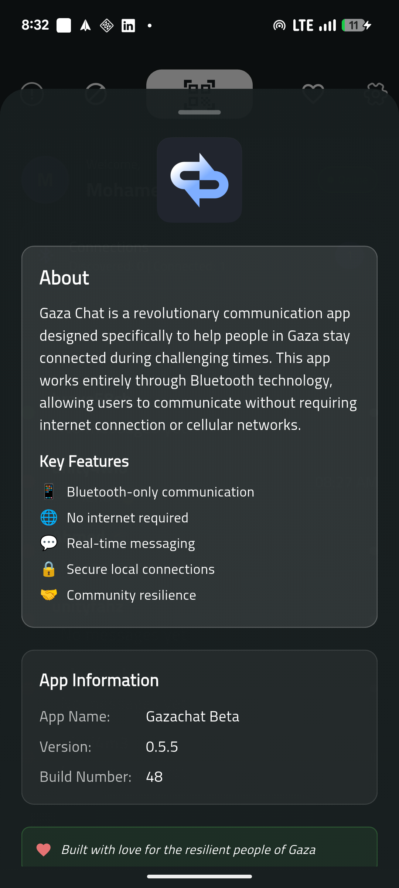</td>
      <td>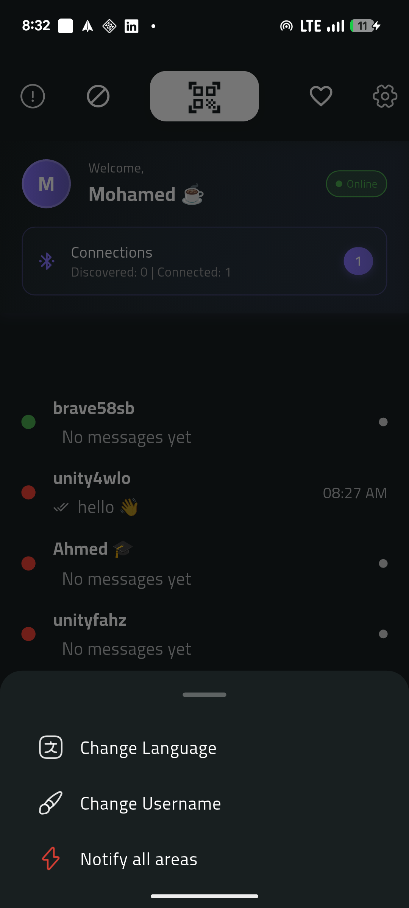</td>
      <td>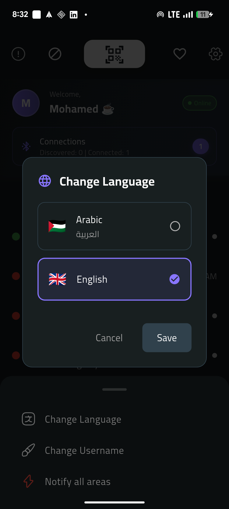</td>
      <td>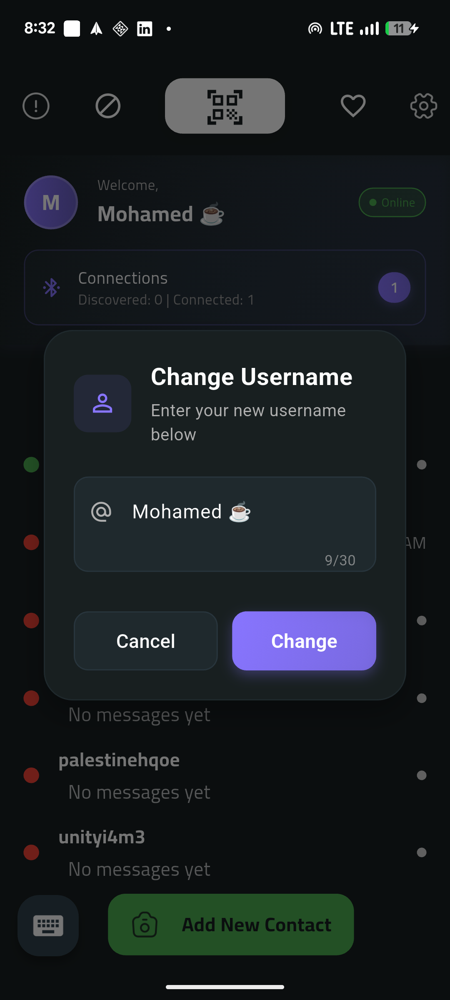</td>
    </tr>
  </table>

### Additional Features

  <table>
    <tr>
      <td>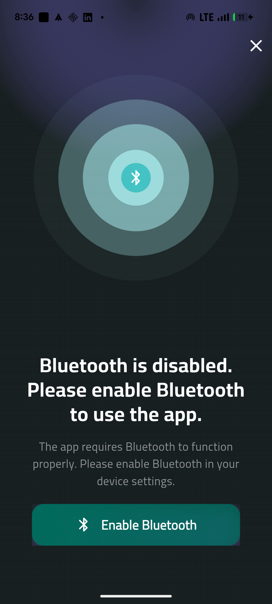</td>
      <td>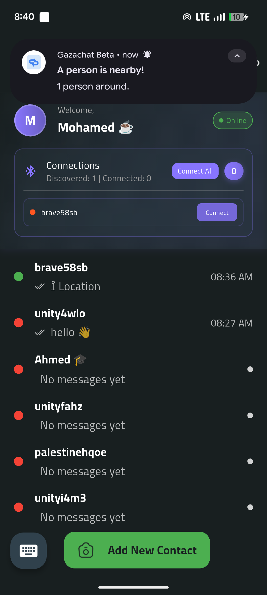</td>
    </tr>
  </table>

</div>

## 🛠️ Tech Stack

- **Framework**: Flutter
- **Language**: Dart
- **Connectivity**: Bluetooth Low Energy (BLE)
- **Architecture**: Clean Architecture with BLoC pattern
- **Platform**: Android (IOS support in progress)

## 🚀 Quick Start

### Prerequisites

- Flutter SDK (>=3.0.0)
- Android Studio / VS Code
- Android device with Bluetooth support
- iOS device (for iOS development)

### Installation

```bash
# Clone the repository
git clone https://github.com/Bloul-Mohamed/moochat_app.git "moochat"

# Navigate to project directory
cd moochat

# Install dependencies
flutter pub get

# Run the app
flutter run --flavor development
```

## 🤝 Contributing

We welcome contributions from the community! moochat is an open-source project that thrives on collaboration.

### How to Contribute

1. **Fork** the repository
2. **Create** a feature branch (`git checkout -b feature/amazing-feature`)
3. **Commit** your changes (`git commit -m 'Add amazing feature'`)
4. **Push** to the branch (`git push origin feature/amazing-feature`)
5. **Open** a Pull Request

### 🐛 Found a Bug?

If you find a bug, please [open an issue](https://github.com/Bloul-Mohamed/moochat_app/issues/new) with:

- Clear description of the problem
- Steps to reproduce
- Expected vs actual behavior
- Screenshots (if applicable)

### 💡 Feature Requests

Have an idea? We'd love to hear it! [Open a feature request](https://github.com/Bloul-Mohamed/moochat_app/issues/new) and let's discuss.

## 📋 Roadmap

- [ ] End-to-end encryption
- [ ] File sharing capabilities
- [ ] Group messaging
- [ ] Message persistence
- [ ] Cross-platform desktop support
- [ ] Voice messages
- [ ] Location sharing

## 🏆 Contributors

Thanks to all our amazing contributors who make moochat better every day!

### 🌟 All Contributors

### 📊 Contribution Stats


### 🚀 GitHub Contributors Graph

[](https://github.com/Bloul-Mohamed/moochat_app/graphs/contributors)

<div align="center">
  <em>Click on any contributor image above to see their GitHub profile!</em>
</div>

## 📄 License

This project is licensed under the MIT License - see the [LICENSE](LICENSE) file for details.

## 🌟 Support the Project

If you find moochat useful, please consider:

- ⭐ **Starring** the repository
- 🐛 **Reporting** bugs and issues
- 💡 **Suggesting** new features
- 🤝 **Contributing** code
- 📢 **Sharing** with others

## 📞 Contact

- **Project Lead**: [Bloul Mohamed](https://github.com/Bloul-Mohamed)
- **Issues**: [GitHub Issues](https://github.com/Bloul-Mohamed/moochat_app/issues)
- **Discussions**: [GitHub Discussions](https://github.com/Bloul-Mohamed/moochat_app/discussions)

---

<div align="center">
  <strong>Built with ❤️ for the resilient people of moo</strong>
  
  [](https://github.com/TheBSD/StandWithPalestine/blob/main/docs/README.md)
</div>
